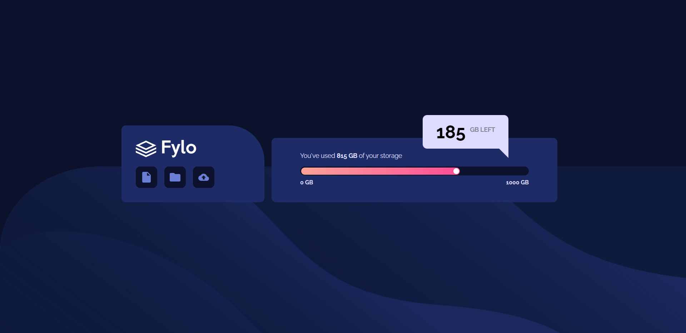
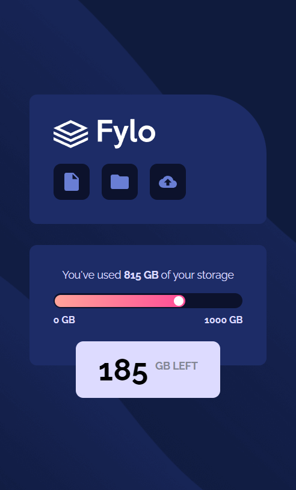

# Frontend Mentor - Fylo data storage component solution

This is a solution to the [Fylo data storage component challenge on Frontend Mentor](https://www.frontendmentor.io/challenges/fylo-data-storage-component-1dZPRbV5n). This is a [Next.js](https://nextjs.org/) project bootstrapped with [`create-next-app`](https://github.com/vercel/next.js/tree/canary/packages/create-next-app).

## Table of contents

- [Overview](#overview)
  - [The challenge](#the-challenge)
  - [Screenshot](#screenshot)
  - [Links](#links)
  - [Getting Started](#getting-started)
  - [Built with](#built-with)
- [Author](#author)

## Overview

### The challenge

Users should be able to:

- View the optimal layout for the section depending on their device's screen size.

### Screenshot

|  |  |
| ------------------------------ | ----------------------------- |
| Desktop version                | Mobile version                |

### Links

- Solution URL: [Code on GitHub](https://github.com/malek-bt/Fylo-data-storage)
- Live Site URL: [GitHub Pages Live URL](https://ffylo-data.vercel.app/)


### Getting Started

First, run the development server:

```bash
npm run dev
# or
yarn dev
# or
pnpm dev
```
Open [http://localhost:3000](http://localhost:3000) with your browser to see the result.

### Built with

- Semantic HTML5 markup
- CSS custom properties
- Flexbox
- NextJS

## Author

- Frontend Mentor - [@malekbentaher](https://www.frontendmentor.io/profile/malek-bt)
- Linkedin - [@malek-bentaher-361028222](https://www.linkedin.com/in/malek-bentaher-361028222/)
